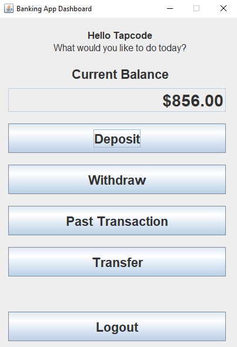

# Bank App with Swing and MySQL

A simple bank application with a graphical user interface (GUI) developed in Java using the Swing framework. The application interacts with a MySQL database to perform essential banking operations.

## Features

- **Login**: Users can log in using their credentials.
- **Register**: New users can create a bank account.
- **Deposit**: Users can deposit funds into their account.
- **Withdraw**: Users can withdraw funds from their account.
- **Check Balance**: Users can view their current account balance.
- **Logout**: Securely log out of the account.
- **Transaction History**: Users can view a history of their past transactions.
- **Transfer**: Users can transfer funds to other users within the MySQL database.

## Screenshot

<div align="center">
  
</div>

## Technologies

- Java Development Kit (JDK 18)
- MySQL Database

## Getting Started

### Prerequisites

You need the following to run the project:

- [Java JDK 18](https://www.oracle.com/java/technologies/javase/jdk18-archive-downloads.html)
- [MySQL](https://dev.mysql.com/downloads/installer/)

### Installation

1. Clone the repository:

   ```bash
   git clone https://github.com/yourusername/bank-app.git
